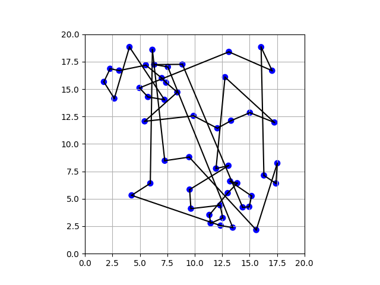

# Traveling Salesman Problem Solver using Ant System Algorithm

This repository contains a Python implementation of the Ant System (AS) algorithm for solving the Traveling Salesman Problem (TSP). The Ant System is a probabilistic technique for solving computational problems which can be reduced to finding good paths through graphs, and it's particularly effective for the TSP.

## Description

The Ant System algorithm utilizes a colony of artificial ants which iteratively construct solutions based on pheromone trails and heuristic information. The solution mimics the behavior of ants searching for the shortest path between their colony and food sources.

This project demonstrates the implementation and visualization of the Ant System algorithm to solve the TSP for a set of randomly generated city locations. The algorithm’s progress is visualized using matplotlib, and the evolution of the solution is saved as an animated GIF, showing the improvement over iterations.

## Features

- **Ant System Algorithm**: Core implementation of the AS algorithm to solve the TSP.
- **Dynamic Visualization**: Real-time visualization of paths as they are improved by the algorithm.
- **GIF Creation**: Generates a GIF animation of the algorithm’s execution, illustrating the path optimization process.

## Dependencies

To run this project, you'll need the following Python libraries:

- `numpy`
- `matplotlib`
- `Pillow`

You can install these with the following command:

```bash
pip install numpy matplotlib pillow
```

## Usage

To execute the program, simply run the `tsp_solver.py` file in your Python environment:

```bash
python tsp_solver.py
```

This will start the computation and visualization process, saving the resulting animation as `tsp_solution.gif` in the project directory.

## Output

After running the script, the algorithm will generate:

- A real-time plot showing the shortest path found.
- A GIF animation `tsp_solution.gif` showing the progress of the algorithm over time.

## Displaying the GIF

Here is the GIF showing the evolution of the TSP solution over time:



